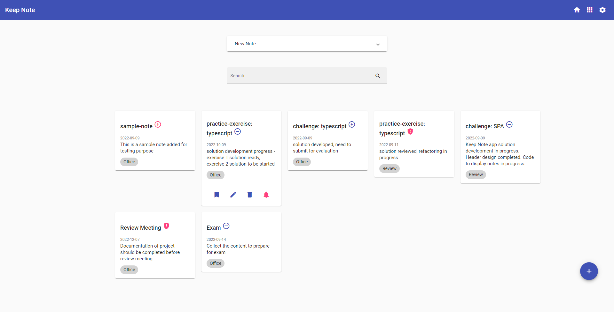

## Keep Note

#### Context

Keep Note is a web app that allows user to maintain notes.  The app should be designed as a single page application.​

Based on SPA approach, the app should be developed by creating components.​

The phase 1 and 2 of development are completed. During these two phases, the components are created to add, view and search notes. The persistence has been implemented and notes are added and retrieved from the server.

By making HTTP calls to json-server, notes are fetched from and saved in `notes.json` file located in `keep-note-data` folder.​

