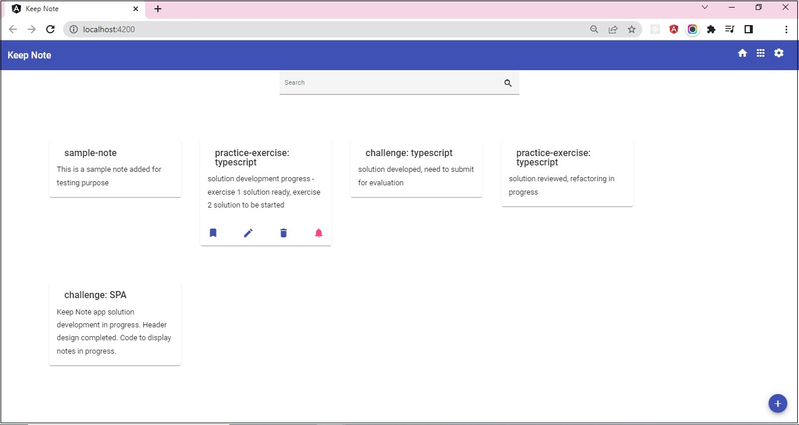

## Challenge - Keep Note

#### Context

Keep Note is a web app that allows user to maintain notes.  The app should be designed as a single page application.​

Based on SPA approach, the app should be developed by creating components.​

The phase 1 and 2 of development are completed. During these two phases, the components are created to add, view and search notes. The persistence has been implemented and notes are added and retrieved from the server.

By making HTTP calls to json-server, notes are fetched from and saved in `notes.json` file located in `keep-note-data` folder.​

In phase 3 development, the Keep Note app should be styled using Angular Material components.

**Note:** The Angular Material packages should be installed in the solution code of `Keep Note` developed in the `challenge` of `Sprint 4: Build Reusable Application Logic using Angular Services` of `Angular Course: Building Single Page Applications Using Angular`

#### Task 1 - Install Angular Material

- Install Aangular Material packages using Angular CLI command.
- While installation, select a prebuilt-theme, allow Angular Material Typography styles to be installed and include and enable animations.

#### Task 2 - Style App Header

- The `Header` component should be styled containing the app title `Keep Note` and navigation icons.

#### Task 3 - Style `Note-Add` Component

- It is recommended that to keep UI clutter-free, the view for `Note-Add` component should be hidden / collapsed, and should be made visible only when user clicks on add button.
- The input field should appropriately communicate the user about the input that needs to be provided.

#### Task 4 - Style `Note-View` Component

- The notes displayed by `Note-View` component should be displayed in card format.
- For a clutter-free the buttons on the note card can be kept hidden and they are visible only when note is selected or hovered.

#### Task 5 - Style `Search` Component

- The `Search` component design can be kept simple by having only an input field that accepts note titel as the input to search.
- The search can be performed as the user starts inputting the search text.
- An icon can be used with the search input field to suggest its intended purpose.

**Note**

- The [Google Keep](https://keep.google.com/) app UI can be used as a reference to design `Keep Note` UI.
- The sample layout suggested for the `Keep Note` app is provided in the image below:

    

